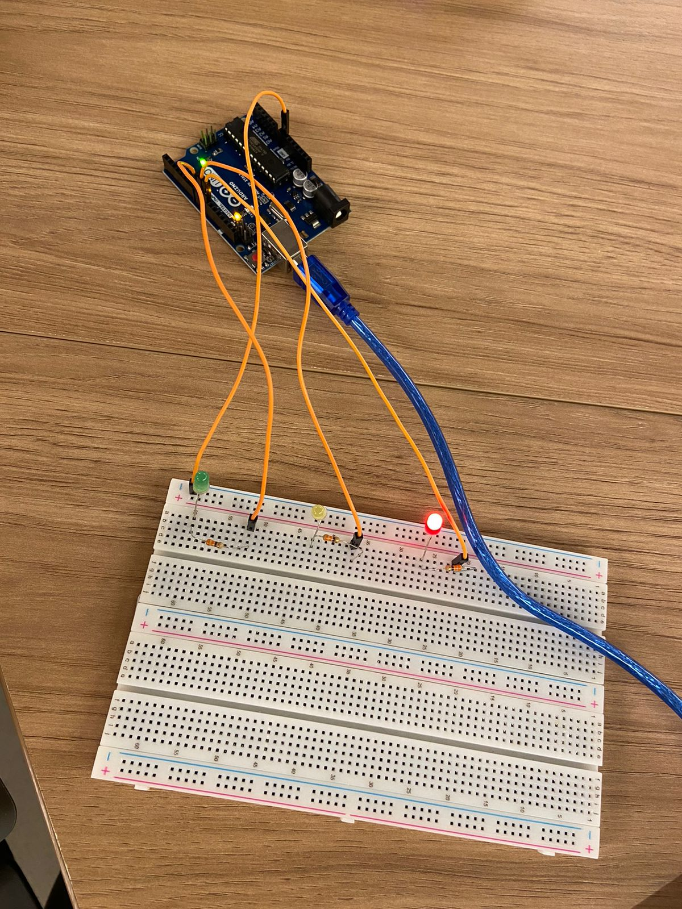

# PonderadaFarolOffline

# PonderadaArduino-Semana3
**Ponderada Arduino - Semana 2 (Projeto Farol)**

**Nome:** Eduardo Farias Rizk
**Turma:** 12 
**Módulo:** 4 - Engenharia de Software 

Este exercício consistia em montar e programar um semáforo que garanta a segurança de pedestres e veículos, seguindo a lógica de tempo de cada fase das luzes, desde a montagem dos LEDs até a programação da sequência correta.

#

# Parte 1 - Montagem Física do Semáforo
Nesta etapa, vou deixar uma imagem abaixo representando a construção física do projeto do farol

![Projeto]

Eu utilizei a seguinte lógica na construção:
- Led Verde: 
- Led Amarelo:
- Led Vermelho:
  
Coloquei os resistores para não queimar os leds
Depois liguei a minha corrente postiva vindo do arduino, e no fim da corrente liguei o terminal negativo do led em uma corrente negativa

## Especificações dos Componentes Utilizados
Para complementar o entendimento do projeto, abaixo segue a lista dos componentes utilizados e a explicação de cada um deles

| Componente    | Especificação                             | Quantidade | Função                                                       |
|---------------|------------------------------------------|------------|--------------------------------------------------------------|
| Arduino Uno   | Microcontrolador ATmega328P              | 1          | Controla o funcionamento e a lógica do semáforo              |
| Protoboard    | Protoboard padrão                        | 1          | Base para a conexão e organização dos componentes            |
| LED Vermelho  | Tensão: 2V, Corrente: 20mA              | 1          | Representa a fase de "parar" no semáforo                     |
| LED Amarelo   | Tensão: 2V, Corrente: 20mA              | 1          | Representa a fase de "atenção" no semáforo                   |
| LED Verde     | Tensão: 2V, Corrente: 20mA              | 1          | Representa a fase de "seguir" no semáforo                    |
| Resistores    | Ω                                     | 3          | Limitam a corrente para proteger os LEDs                     |
| Cabos Jumper  | Cabos macho-macho                        | 4    | Conectam os componentes ao Arduino e à protoboard            |

# Parte 2: Programação e Lógica do Semáforo
Nesta etapa eu realizei o código para o projeto. O código fonte está no repositório e ele segue a seguinte regra para a sequência dos faróis.

- 6 segundos no vermelho
- 2 segundos no amarelo
- 2 segundos no verde
- 2 segundos de pausa para separação de tempo do led verde
- +2 segundos no verde (simulando um tempo adicional para pedestres terminarem a travessia)
- 2 segundos no amarelo
